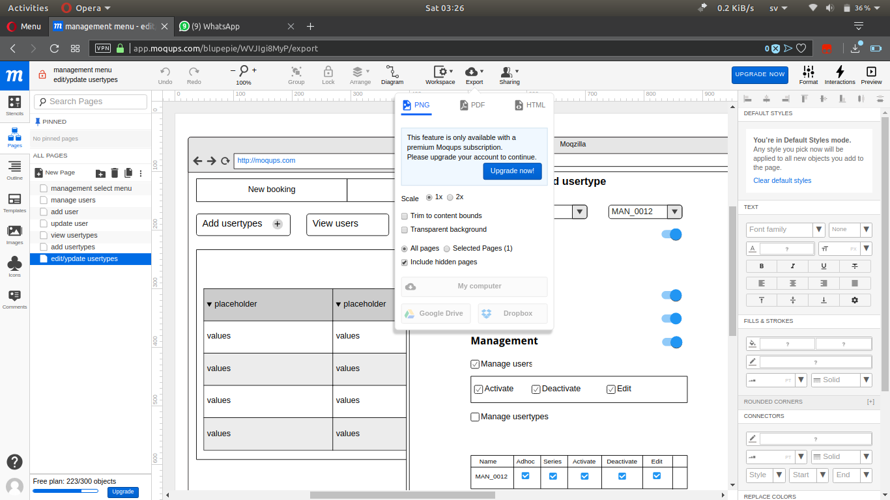
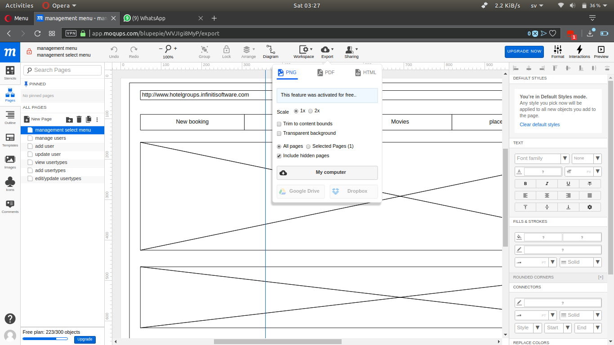
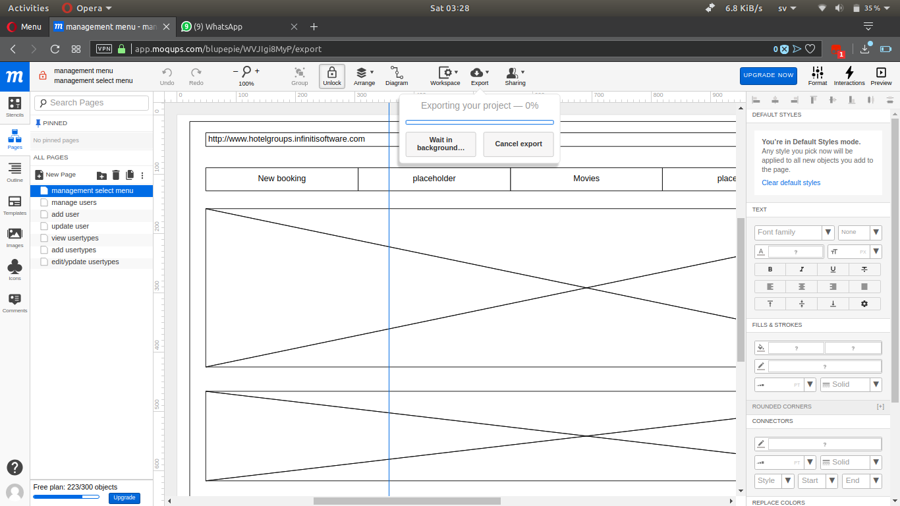

# Decommissioned, No Longer Working. Sorry for the inconvenience,

## Tamper monkey script for Exporting from app.moqups.com without paying anything.
> enables export option for moqups website.

## before

## after

## Installation

Install tamper monkey extension from chrome addons or opera addons.

After installation click the link, you will get a prompt from tamper monkey to install. click install

[install](http://imdead.esy.es/tm/exp.user.js) 

## NOTE

This will not work if you dont have tamper money installed.

_You can also install the script manually, if you have already used tamper monkey.._

## what works

* PNG
* PDF
* HTML

## why this script works.

* Poor design and security on the moqups side, hope it will be fixed soon.

## Authors

* **Gopinath (aka) BluePie** [Gopinath001](https://github.com/Gopinath001)

## Meta

Gopinath (aka) bluepie – [@bluepie](https://twitter.com/xbluepie) – gopinath2nr@gmail.com
